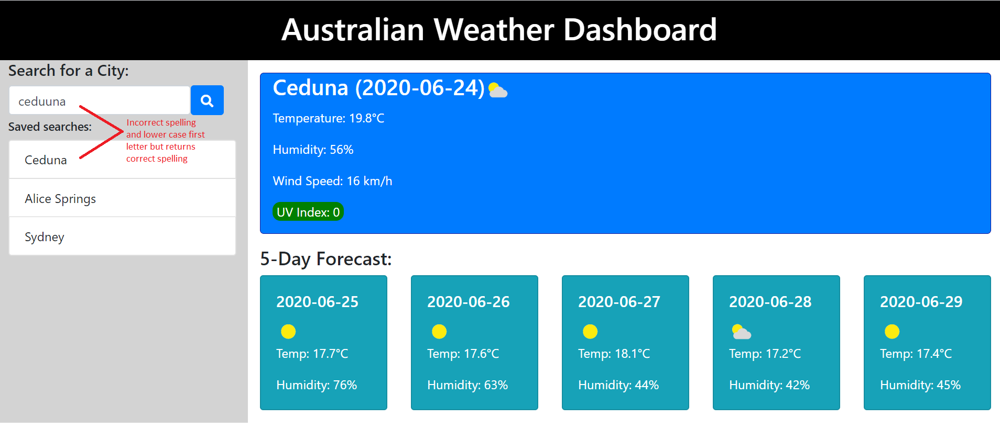

# Hows The Weather App
The Hows the weather app was built to show current day weather and a 5 day forecast.

App Link - https://emoschos.github.io/hows-the-weather/

I chose to use weatherbit.io instead of openweather to complete this task and the app satisfies all the acceptance criteria.

## Structure
### HTML:
I tried to build as much of the static structure of the app in HTML such as the main display and cards with h-tags and p-tags.  This help reduce any potential JS bugs into the code.

### CSS:
Bootstrap was utilised to make the app responsive.  Some additional custom classes and styling was included so that i could see what the styling was and what it was affecting.

### JS/JQuery:
JQuery was utilised in the building of the app.  I created a scriptV1.js so that i could have a functioning app that could be deployed.  I went on further to refactor and add functions that polished the app to make it better for the user which became my final script.js (V2).  Theres commenting in the JS file that goes into detail of the structure created.

## Functionality:
When a user first opens the app there will be no weather information, only place holders for the first search.
When a user enters an Australian city name and it is validated, then the app will retrieve the data and populate the main display with current day and the 5 day forecast will populate the 5 forecast cards and the city will be added to the list with correct spelling and format.  In some case depending on the typo the app will return the city with the correct spelling and will add it to the list but if it does not recognise the spelling then it will alert the user.
If the user has already completed a successful search and enters the same name in the search again.  The app will not duplicate the city name on the list but instead hoist that city to the top of the saved searches listing.
If a user clicks on a saved search listing then the data will populate the displays and it will be hoisted to the top of the listing
When the user closes or refreshes the browser then the last searched listing (the city at the top of the listing) will appear in the weather displays and also on the saved search listings.

## Result:

